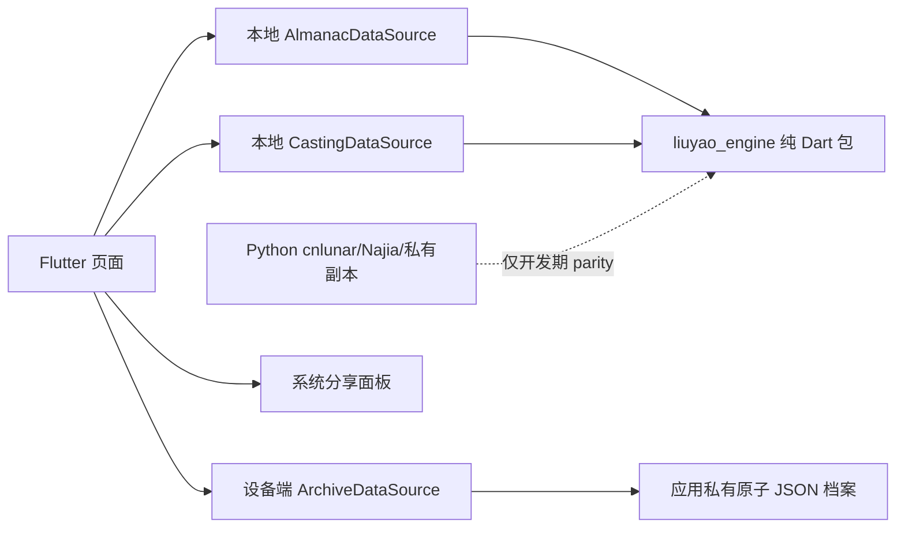

# 完全离线 Dart 架构

> 状态：`Implemented`  
> 版本：1.1  
> 日期：2026-08-07

## 1. 运行时边界



APK 不依赖 Node、Python、HTTP、远程数据库或模型服务。Python 与历史 Node 服务只保留为研究、回归和迁移参考。

## 2. 算法轮子

`packages/liuyao_engine` 是生产唯一算法源，公开入口为 `package:liuyao_engine/liuyao_engine.dart`。包本身没有 Flutter 与平台依赖，可独立测试和后续拆仓开源。

算法合同：

- 六爻 schema v16 / engine `0.16.0+three-layer-annotations`；
- 时间口径统一为 Asia/Shanghai 墙上时间，内置 1901–2100 IANA offset 变更；
- cnlunar 原始农历月表、节气压缩表和 lunar-python 1.4.8 的 1901–2099 精确“节”时刻冻结在 Dart 常量中；
- 私有参考合同与产品完整伏卦、京房逐爻宿并存，不以对照实现覆盖用户已确认规则；
- 历史案例保存结果快照，不随新规则自动重算。

## 3. 校验门禁

| 门禁 | 覆盖 | 当前结果 |
|---|---:|---:|
| `check_offline_almanac_parity.py` | 旧 cnlunar 仍应兼容的农历、日/时柱、12 时槽、节气日期、财神 | 16,115/16,115 |
| `check_offline_liuyao_structure_parity.py` | 64 本卦 × 64 变卦 | 4,096/4,096 |
| `check_offline_liuyao_annotation_parity.py` | 64 卦 × 60 日柱的非土长生与未变更五项产品神煞 | 3,840/3,840 |
| `check_offline_mobile_release.py` | 生产源码、Manifest、可选 APK 权限 | 必须零网络能力 |
| `check_private_reference_dart_parity.py` | 64 卦、动爻、60 纳音、144 长生、2,388 交节边界 | 必须全相等 |

## 4. 档案合同

设备端文件根对象为：

```json
{
  "schema_version": 1,
  "updated_at": "UTC timestamp",
  "cases": {"case-id": {"chart": "完整版本化排盘快照"}}
}
```

旧版 `case-id -> case` 根对象在读取时兼容，下次写入迁移为 v1。写入先生成 `.tmp` 并 flush，再原子替换正式文件。JSON 损坏、未知 schema 或 I/O 失败必须抛出 `ArchiveStorageException`，不得当作空库继续覆盖。

## 5. 发布约束

- main Manifest 禁止 `INTERNET`、`ACCESS_NETWORK_STATE`、`CHANGE_NETWORK_STATE`。
- 生产源码禁止 `package:http`、Dio、HttpClient、Socket、WebSocket 和 HTTP URI 构造。
- release APK 构建后必须用 `apkanalyzer manifest permissions` 复核。
- debug/profile Manifest 可保留 Flutter 调试所需 INTERNET，但不得作为可交付安装包。
