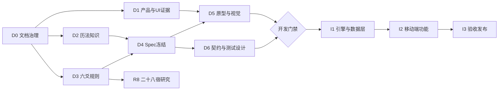

# 六爻排盘与存档产品总工作计划

> 状态：`Active`  
> 计划版本：0.4  
> 最近更新：2026-08-07  
> 当前阶段：I3 离线 release APK 已就绪，进入用户审阅；暂停未核验规则扩展  
> 原则：先知识与 Spec，后设计与开发

## 1. 最终目标

交付一个移动端优先、规则可追溯的产品，包含万年历、六爻起卦、完整基础卦面、五行十二长生、指定神煞、可编辑和导出的案例档案，并为二十八宿后续扩展保留清楚边界。所有关键计算过程均可在卦面下展开核对。

当前计划把 Agent 完全移出实现路径。生产运算和档案均在设备端完成；将来如重新立项，Agent 只能消费版本化排盘快照，不能成为基础功能的前置依赖。

## 2. 阶段总览

`D` 代表文档/设计，`I` 代表后续实现；`R8` 可并行研究，但不阻塞不含二十八宿的基础版本。

## 3. 文档与设计阶段

### D0 — 文档治理与基线

目标：建立所有讨论的统一落点。

任务：

1. 建立文档总索引、目录、状态流转和变更规则。
2. 建立 PRD、Spec 模板、来源表、决策日志、问题台账和变更日志。
3. 盘点当前代码、历史文档和 Taoracle 中可复用的六爻资料。
4. 区分“已确认需求”“候选规则”“现有实现行为”。
5. 给旧文档增加定位说明，避免多个事实源。

完成标准：所有关键需求都能链接到明确文档；聊天不再是唯一记录。

当前状态：**主体已建立，等待本轮审阅**。

### D1 — 产品范围与 UI 对标证据

目标：确认产品结构与页面方向，但不把竞品作为算法来源。

任务：

1. 已归档四张参考截图；名称不再作为前置条件，继续获取参考产品官方入口、版本和完整流程录屏。
2. 按 UI-01 至 UI-12 采集关键页面。
3. 逐屏记录事实、可借鉴点、不适用点和影响的 Spec。
4. 冻结一级导航与页面清单。
5. 评审三条端到端流程：日历到起卦、起卦到保存、档案到导出。
6. 提炼项目自己的视觉关键词，不复制竞品资产。

交付物：证据目录、对标矩阵、信息架构、用户流程。

完成标准：每个借鉴结论有证据编号；无证据项明确标为自主设计。

### D2 — 万年历知识准备

目标：冻结历法字段和时间边界，使排盘上下文可靠。

任务：

1. 列出公历、农历、干支、生肖、节气、节日、值日宿等候选字段。
2. 区分纯展示字段与六爻计算必需字段。
3. 以 cnlunar 为首选基础，完成精确 commit、许可证、1901–2100 边界和权威校验来源审计。
4. 冻结时区、节气时刻、子初换日、立春换年和干支月边界。
5. 决定地点、经度和真太阳时是否进入首版。
6. 建立至少 10 个边界样例：跨年、春节、立春、节气、闰月、子时、时区。
7. 单独决定值日二十八宿是否首版展示。

交付物：字段字典、时间口径、golden cases、完整 SPEC-001。

完成标准：任何时间结果都能说明采用的口径，且边界样例可人工核对。

### D3 — 六爻基础知识与规则准备

目标：把规则写成与编程语言无关、可以手工复算的定义。

基础排盘任务：

1. 统一初爻/上爻、数组方向和阴阳动静枚举。
2. 冻结本卦、变卦、八卦编码和卦名。
3. 冻结纳甲、地支五行、卦宫、世应、六亲、六神和伏神。
4. 每个模块写输入、输出、查表/公式、异常和样例。
5. 审计现有 `najia==2.0.1`，把库行为视为对照，不自动视为权威。

十二长生任务：

1. 确认采用五行体系而非十干阴阳顺逆体系。
2. 确认土寄宫口径。
3. 固定 5×12 表和逐爻映射方法。
4. 区分十二长生“沐浴”和同名神煞/辅助标记。

神煞和辅助结构任务：

1. 保留用户指定的 20 个名称原文。
2. 逐项确认规范名、别名、输入域、取法、输出落点和来源。
3. 把驿马等命中规则与卦身/世身等结构规则分层。
4. 每项准备命中、未命中和冲突样例。
5. 定义完整 trace 字段，使所有运算能在卦面下展开。

交付物：规则字典、查表草案、样例集、完整 SPEC-003/004。

完成标准：读者不看代码也能复算全部基础字段；20 项名称无遗漏。

### D4 — 功能 Spec 冻结

目标：将规则结论转为可实现、可验收的规格。

建议评审顺序：SPEC-001 万年历 → 002 起卦 → 003 卦面 → 004 规则标注 → 005 档案 → 006 导出 → 007 UI。SPEC-008 保持研究态，直到用户资料完整。

每个 Spec 的评审动作：

1. 检查范围重叠和遗漏。
2. 检查术语与规则字典一致性。
3. 补齐输入、输出、状态、错误、隐私和迁移。
4. 把正文 TODO 全部转入开放问题台账。
5. 为每条 `FR-*` 写对应的 `AC-*`。
6. 用户确认后改为 `Ready` 并记录版本。

完成标准：本期实现所需 Spec 全部 `Ready`，相关 P0 问题全部关闭。

### D5 — 线框、视觉与可用性验证

目标：在写 Flutter 页面前解决信息密度和交互问题。

任务：

1. 先做低保真线框，再做视觉装饰。
2. 验证月历密度、日详情、起卦步骤、撤销和确认。
3. 使用真实完整卦验证卦面，不使用简短占位数据。
4. 覆盖伏神、多动爻、多个神煞命中的最拥挤状态。
5. 在 360dp、常见 Android 宽度和大字体下检查。
6. 验证档案的解读版本、反馈时间线和导出预览。
7. 结合竞品证据建立 design tokens 和高保真关键页面。
8. 记录逐屏用户评审结论。

交付物：线框、可点击原型、组件状态表、design tokens、评审记录。

完成标准：核心流程无结构性阻塞，小屏卦面可读，空/错/加载状态齐全。

### D6 — 数据契约、测试与迁移设计

目标：编码前确定各层的数据交换和历史保护方式。

任务：

1. 定义 `CastingRecord`、`AlmanacContext`、`ChartSnapshot`、`RuleTrace`、`Case`、`AnalysisVersion`、`FeedbackEntry`、`ExportBundle`。
2. 定义 `AlmanacAdapter`，隔离 cnlunar 的 Python 对象、中文拼接字段和版本变化。
3. 为所有结构定义 JSON Schema 与 schema version。
4. 以 Python 为权威对照、Dart 为生产实现，使用穷举/边界 parity 避免手写漂移。
5. 设计设备端版本化档案容器、原子写入、损坏保护和迁移；未来需要 SQLite 时保持同一 Case 合同。
6. 定义规则包版本和历史案例重算策略。
7. 建立契约测试、golden tests、迁移测试和 UI fixtures。
8. 准备静卦、多动含伏神、规则标注密集三组完整案例。
9. 定义 PDF/JSON 导出 schema 与快照测试。

完成标准：接口示例覆盖所有页面；历史案例无需在线重算；三端字段同义。

## 4. 增量开发与发布门禁 G0

用户已于 DEC-016 授权按模块逐项开发，并于 DEC-048 明确私有副本只能作为可执行参考。单个切片进入实现前至少满足：范围和输出明确、未解决问题已隔离、具有固定样例、实现状态可回写文档。万年历、手动/自动起卦、基础卦面、四土本气十二长生、当前五项神煞与卦身/命爻、两类二十八宿，以及精确快照存档和迁移均已完成。其余规则扩展、五星入卦仍等待资料。

完整产品进入发布候选前仍必须同时满足：

- PRD 已确认。
- 本期 Spec 均为 `Ready`。
- 所有相关 P0 问题关闭。
- 六爻和历法 golden cases 已人工核对。
- 关键页面线框及高密度卦面已评审。
- 数据契约与迁移方案已冻结。
- 开发任务能逐条回链到 `FR-*` 和 `AC-*`。

条件不满足时，不得把相邻或未授权能力顺带并入当前切片。增量实现不等于对应完整 Spec 已经发布就绪。

## 5. 后续实现阶段（门禁通过后）

### I1 — 引擎与数据基础

1. 建立版本化 schema 和跨语言模型。当前生产 schema v16 已进入独立纯 Dart 包。
2. 修正基础字段拆分，确保天干、地支、五行独立。
3. 完成基础排盘引擎与 calculation trace。当前 schema v3 已拆分纳甲字段，完成卦宫、世应、六亲、六神、伏神和变卦的可展开计算链；传统最终主来源仍待补齐。
4. 完成十二长生和已冻结标注插件。历史规则实现仍保留，schema v15 起产品只输出驿马、桃花、禄神、华盖、天乙贵人及卦身、命爻；schema v16 再补齐本伏变三层长生。合同支持干/支输入、双目标、多命中、明确未命中、别名、边界、异法隔离和独立标注层。
5. 完成万年历模块。当前已完成 cnlunar 精确纯 Dart 移植、Flutter 月历/日详情及 16,115 个 Python 对照快照；服务端仅保留测试参考。
6. 完成设备端 Case 存储。当前已实现快照保存、列表/搜索、详情、解读修订、反馈新增/修改、两种导出、旧版迁移和原子写入。
7. 把固定样例全部加入自动化测试。

### I2 — 移动端产品

1. 导航与 design tokens。首个暖纸色/朱砂红切片及四段导航已实现，完整 token 评审仍待真机验证。
2. 万年历与日期详情。月切换、回今天、选日、四柱/纳音、13 时辰与财神首个闭环已实现。
3. 手动/自动起卦。两个核心模式、原始过程、确认与预览均已实现；进程重启草稿恢复待后续。
4. 基础卦面、高阶标注和计算明细。当前基础卦面、十二长生账页、五项神煞与卦身/命爻标注卡、完整明细及变卦世应已实现；新增规则暂停。
5. 档案列表、详情、解读版本和反馈。基础审阅切片已实现。
6. Markdown/JSON 导出已实现；PDF 为后续独立切片。
7. 加载、离线、错误和恢复状态。

### I3 — 集成验收与发布

1. 独立 Dart 包测试、Python↔Dart parity、Flutter 分析与测试。
2. Android 真机验证时间、字体、分享和文件权限。
3. 完整案例端到端回归。
4. 旧档案迁移和规则版本验证。
5. 安全与隐私检查。
6. 用户验收和首版已知限制清单。

## 6. R8 — 二十八宿独立研究

1. 用户提供原始资料。
2. 登记来源、页码、版本、异名和流派。
3. 分别建立“万年历值日宿”和“六爻/五星入卦”规则图。
4. 明确五星、建候、积算的概念与中间量。
5. 手工复算至少 10 个样例。
6. 确定结果落点和卦面展示。
7. 冻结 SPEC-008、schema 和 trace。
8. 作为后续独立功能包实现，不改写基础卦面字段。

## 7. 同步机制

每次讨论后：更新相关 Spec；决定写入 decision log；未解决事项写入 open questions；change log 留摘要。

每个 Spec 评审时：先解决 P0；逐条核对功能要求和验收；用真实复杂样例做“新读者测试”；由用户确认版本。

每个实现阶段后：更新实现状态与链接；记录偏差和迁移；保存测试证据；不以口头“差不多”代替验收。

## 8. 风险与预案

| 风险 | 后果 | 预案 |
|---|---|---|
| 传统规则有流派差异 | 同输入输出不一致 | 规则版本化、来源登记、冲突样例、用户决策 |
| 卦面信息过密 | 手机难读 | 首层/展开分层，用真实复杂卦测试 |
| 时间边界不明 | 干支连锁错误 | 先冻结历法口径和边界样例 |
| 第三方库字段不稳定 | 契约错误扩散 | 适配层、契约测试、不直出库对象 |
| 规则升级污染历史 | 档案无法复盘 | 保存原始输入、规则版本和结果快照 |
| 对标资料不足 | UI 决策靠猜 | 证据模板；无证据时注明自主设计 |
| 二十八宿过早进入 | 基础版本延期 | 独立 R8 路线和功能开关 |
| Spec 与代码脱节 | 返工 | FR/AC 与任务、测试双向链接 |

## 9. 当前下一步

1. [x] 运行独立包、Flutter、Python、三组 parity 与断网源码全套门禁。
2. [x] 构建新的 release APK，以 `apkanalyzer` 确认无网络权限并记录 SHA-256。
3. [ ] 用户依次走查：万年历 → 手动/自动起卦 → 完整卦面 → 自动存档 → 档案 → 解读/反馈 → 导出。
4. [ ] 将审阅意见实时回写 SPEC-002/003/005/006/007、开放问题和变更日志。
5. [ ] 正式分发前配置 release keystore，并确认产品名、应用 ID 和项目许可证。
6. 审阅结束前不恢复其余神煞与五星入卦开发。
