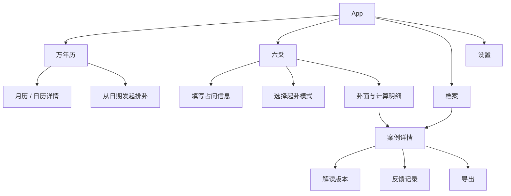

# 产品需求文档：万年历、六爻排盘与案例档案

> 文档编号：PRD-001  
> 状态：`Draft`  
> 版本：0.1  
> 最近更新：2026-08-05  
> 关联计划：[总工作计划](../plans/master-plan.md)

## 1. 产品一句话定义

一个以移动端为主的六爻专业工具：用户可以查看万年历、用明确可追溯的方式起卦、获得完整卦面，并将占问、解读和后续反馈长期保存与导出。

## 2. 产品原则

1. **先准确，再丰富**：任何传统规则先确定口径和样例，再进入代码。
2. **卦面完整但不拥挤**：基础信息默认可读，高阶规则允许分层展开。
3. **计算可追溯**：不能只给结论；纳甲、六亲、六神、伏神、世应、神煞等运算需能查看依据。
4. **档案属于用户**：案例可持续编辑、保留历史版本并完整导出。
5. **工具优先**：当前不引入 Agent，不做自动断卦，不将模型能力作为核心依赖。
6. **视觉借鉴不照抄**：以用户提供的参考图作为主要 UI 对标，但产品命名后置，品牌、信息结构和专业数据表达保持独立。

## 3. 目标用户与核心任务

### 3.1 初步用户假设

- 学习六爻、需要可靠排盘的用户。
- 已经会断卦、需要整理案例和复盘的使用者。
- 对传统历法感兴趣，希望从万年历进入排盘的用户。

这些画像目前是工作假设，后续需要通过访谈或实际使用反馈修正。

### 3.2 核心任务

- 快速查某日的公历、农历、干支和排卦时间信息。
- 记录占问，选择合适方式完成起卦。
- 查看完整的本卦、变卦、六爻信息和规则标注。
- 查看每项结果如何计算得出。
- 保存案例，持续补充自己的解读和现实反馈。
- 把单个或多个案例导出，便于备份、分享或二次分析。

## 4. 信息架构

底部一级导航暂定为：`万年历 / 六爻 / 档案 / 设置`。最终名称、顺序和图标由 [SPEC-007](../specs/SPEC-007-ui-system.md) 冻结。

## 5. 功能范围总览

| 模块 | 首版必须具备 | 后续或待定 |
|---|---|---|
| 万年历 | 月历、日期选择、日详情、四柱、逐柱纳音、时辰干支、财神方位、排卦所需时间上下文 | 其他吉神方位、宜忌、节气扩展、搜索、提醒 |
| 起卦 | 手动模式、自动模式、起卦记录 | 数字起卦、时间起卦、其他模式 |
| 基础卦面 | 本卦、变卦、动爻、纳甲、五行、六亲、六神、世应、卦宫、伏神 | 高阶关系可视化 |
| 规则标注 | 五行十二长生；已指定神煞目录 | 流派切换、自定义规则包 |
| 二十八宿 | 建立知识与数据结构规格 | 具体入卦算法和实现时点待定 |
| 档案 | 日期、占问、卦面快照、解读、反馈、检索 | 标签体系、批量管理、云同步 |
| 导出 | 单案例完整导出 | 批量导出、打印模板、多端同步 |
| Agent | 不在当前产品范围 | 待工具和档案稳定后重新立项 |

## 6. 核心用户流程

### 6.1 从六爻入口起卦

1. 用户填写占问问题和可选备注。
2. 系统自动带入当前时间，用户可修改日期、时间、时区和位置相关信息。
3. 用户选择手动或自动起卦模式。
4. 系统记录原始起卦输入，生成本卦、动爻和变卦。
5. 系统补全基础卦面、十二长生和已经启用的神煞。
6. 系统自动保存原始起卦记录和完整卦面快照，然后跳转独立卦面页。
7. 用户可以展开“计算明细”核对来源与中间量，并可立即撰写解读。

### 6.2 从万年历发起排卦

1. 用户在月历选择某日。
2. 进入该日详情，查看历法字段。
3. 点击“以此时间起卦”。
4. 系统把选定时间带入起卦页，其余流程与 6.1 相同。

### 6.3 案例复盘

1. 用户在档案中检索或筛选案例。
2. 进入案例，查看当时保存的卦面快照，而不是用新规则静默覆盖历史。
3. 新增或修改解读；系统保留版本和时间。
4. 事后新增反馈，记录应验情况或事实进展。
5. 按需导出完整档案。

## 7. 数据保真原则

- 案例必须保存**原始输入**、**规则版本**和**结果快照**。
- 规则升级后，历史案例默认保持原样；如支持重算，应生成新的计算版本并展示差异。
- 用户解读与反馈是两种不同数据：解读是对卦的判断，反馈是后续事实记录。
- 自动起卦需保存每一次随机过程的原始结果，不只保存最终 6/7/8/9。
- 所有时间保存时区；界面同时展示用户可读时间和排盘采用的历法时间。

## 8. 非功能需求

- 排盘结果在相同输入、相同规则版本下必须确定性一致。
- 核心排盘和历史档案应在无模型服务时正常工作。
- 移动端优先，主要信息在常见手机宽度下无需横向滚动。
- 敏感信息只存于明确设计的存储层；导出前提示内容范围。
- 规则引擎与 UI 解耦，UI 不自行复制一套计算逻辑。
- 万年历以 cnlunar 为首选计算基础，但通过项目自有适配层提供稳定契约并固定依赖版本。
- 文档、契约、测试和实现共享稳定术语表。

## 9. 成功标准

首个可发布版本至少满足：

- 手动和自动起卦均能完成并保留原始记录。
- 基础卦面字段齐全，无已知确定性计算错误。
- 用户能从月历选日并进入排卦。
- 用户能保存、重新打开、编辑解读、增加反馈。
- 用户能导出一个人类可读且机器可读的完整案例。
- 所有排盘规则都有固定输入的 golden test。
- 新用户能区分“起卦输入”“卦面结果”“解读”“反馈”四类信息。

## 10. 当前不做

- Agent、自动断卦、聊天式解读。
- 紫微、八字、奇门等其他术数。
- 社区、师徒、内容付费、即时通讯。
- 未完成规则评审的五星二十八宿入卦算法。
- 在没有来源登记和样例的情况下堆叠更多神煞。

## 11. 依赖与阻塞

- 已有四张 UI 参考图覆盖万年历、卦面日历联动、手动起卦和独立卦面/档案详情，但仍缺少对标产品官方入口、版本和完整流程录屏；对标记录与截图属内部资料，不随开源仓库分发。
- 万年历的数据源、节气边界、真太阳时范围尚未冻结。
- 神煞中若干名称及取法仍需用户确认。
- 二十八宿必须先区分日历值日宿和六爻入卦体系，再写算法。
