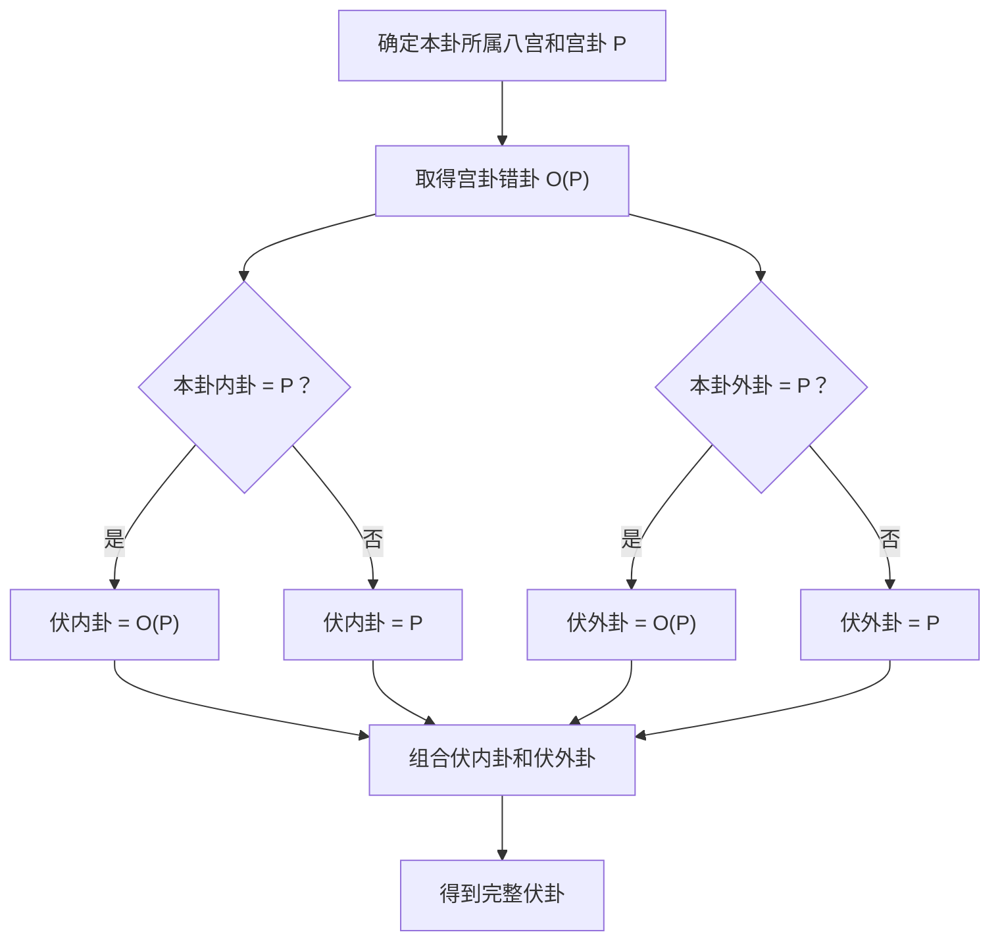

# 六爻八宫与伏卦排法

> 状态：已实现、可公开分享  
> 文档版本：1.0.0  
> 最近更新：2026-08-05  
> 适用范围：六十四卦八宫归属、伏卦生成、伏神纳甲展示  
> 规则输入：项目发起人提供；本文为工程化整理  

## 1. 目的

本文完整说明六十四卦的八宫分类和伏卦生成规则，使实现者不依赖特定软件或私有数据，也能得到稳定、可测试、可解释的结果。

这里的“伏卦”不是无条件取本卦所属宫的八纯卦。正确做法是：先确定本卦所属宫，再把本卦的内卦、外卦分别与该宫经卦比较；相同则取宫卦的错卦，不同则取宫卦，最后将所得两个经卦组合为伏卦。

## 2. 基本约定

### 2.1 爻序和卦码

- 六爻顺序固定为初爻、二爻、三爻、四爻、五爻、上爻。
- 卦码从左到右按初爻至上爻记录。
- 阳爻记为 `1`，阴爻记为 `0`。
- 前三位是内卦，也称下卦；后三位是外卦，也称上卦。

八经卦编码如下：

| 经卦 | 卦码 | 五行 |
|---|---:|---|
| 乾 | `111` | 金 |
| 兑 | `110` | 金 |
| 离 | `101` | 火 |
| 震 | `100` | 木 |
| 巽 | `011` | 木 |
| 坎 | `010` | 水 |
| 艮 | `001` | 土 |
| 坤 | `000` | 土 |

### 2.2 八纯卦和宫卦

乾为天、坎为水、艮为山、震为雷、巽为风、离为火、坤为地、兑为泽是八纯卦。八纯卦的内卦和外卦相同，该经卦同时也是所属宫的宫卦或经卦。

## 3. 八宫分类规则

每一宫从八纯卦开始，在前一次所得卦形的基础上，依次变化以下爻位：

```text
初爻 → 二爻 → 三爻 → 四爻 → 五爻 → 四爻 → 三爻
```

“变化”指将该爻阴阳反转。第一次变化的基础是八纯卦，之后每一次都以上一次变化后的完整卦形为基础。

| 宫内序位 | 名称 | 相对前一卦的变化 |
|---:|---|---|
| 1 | 六世卦、本宫卦、八纯卦 | 不变化 |
| 2 | 一世卦 | 变化初爻 |
| 3 | 二世卦 | 变化二爻 |
| 4 | 三世卦 | 变化三爻 |
| 5 | 四世卦 | 变化四爻 |
| 6 | 五世卦 | 变化五爻 |
| 7 | 游魂卦 | 第二次变化四爻 |
| 8 | 归魂卦 | 第二次变化三爻 |

### 3.1 八宫完整表

| 宫 | 六世 | 一世 | 二世 | 三世 | 四世 | 五世 | 游魂 | 归魂 |
|---|---|---|---|---|---|---|---|---|
| 乾宫 | 乾为天 | 天风姤 | 天山遁 | 天地否 | 风地观 | 山地剥 | 火地晋 | 火天大有 |
| 坎宫 | 坎为水 | 水泽节 | 水雷屯 | 水火既济 | 泽火革 | 雷火丰 | 地火明夷 | 地水师 |
| 艮宫 | 艮为山 | 山火贲 | 山天大畜 | 山泽损 | 火泽睽 | 天泽履 | 风泽中孚 | 风山渐 |
| 震宫 | 震为雷 | 雷地豫 | 雷水解 | 雷风恒 | 地风升 | 水风井 | 泽风大过 | 泽雷随 |
| 巽宫 | 巽为风 | 风天小畜 | 风火家人 | 风雷益 | 天雷无妄 | 火雷噬嗑 | 山雷颐 | 山风蛊 |
| 离宫 | 离为火 | 火山旅 | 火风鼎 | 火水未济 | 山水蒙 | 风水涣 | 天水讼 | 天火同人 |
| 坤宫 | 坤为地 | 地雷复 | 地泽临 | 地天泰 | 雷天大壮 | 泽天夬 | 水天需 | 水地比 |
| 兑宫 | 兑为泽 | 泽水困 | 泽地萃 | 泽山咸 | 水山蹇 | 地山谦 | 雷山小过 | 雷泽归妹 |

## 4. 错卦对应关系

经卦的错卦是三爻阴阳全部反转后的经卦。四组对应关系为：

| 宫卦 | 错卦 |
|---|---|
| 乾 | 坤 |
| 坤 | 乾 |
| 震 | 巽 |
| 巽 | 震 |
| 坎 | 离 |
| 离 | 坎 |
| 艮 | 兑 |
| 兑 | 艮 |

该关系是双向关系，例如乾的错卦是坤，坤的错卦也是乾。

## 5. 伏卦生成规则

设本卦所属宫的宫卦为 `P`，宫卦的错卦为 `O(P)`。

分别判断本卦内卦和外卦：

1. 如果本卦内卦与 `P` 相同，伏内卦取 `O(P)`；否则伏内卦取 `P`。
2. 如果本卦外卦与 `P` 相同，伏外卦取 `O(P)`；否则伏外卦取 `P`。
3. 以伏内卦为下卦、伏外卦为上卦，组合成完整伏卦。



### 5.1 伪代码

```text
palace = palace_trigram(base_hexagram)
opposite = opposite_trigram(palace)

hidden_inner = opposite if base_inner == palace else palace
hidden_outer = opposite if base_outer == palace else palace

hidden_hexagram = combine(hidden_inner, hidden_outer)
```

## 6. 例一：天雷无妄

天雷无妄属于巽宫，宫卦为巽，巽的错卦为震。

- 本卦内卦为震，与巽不同，所以伏内卦取巽。
- 本卦外卦为乾，与巽不同，所以伏外卦取巽。
- 伏内卦巽与伏外卦巽组合，得到巽为风。

因此：

```text
本卦：天雷无妄
所属：巽宫
伏卦：巽为风
```

## 7. 例二：山天大畜

山天大畜属于艮宫，宫卦为艮，艮的错卦为兑。

- 本卦内卦为乾，与艮不同，所以伏内卦取艮。
- 本卦外卦为艮，与艮相同，所以伏外卦取兑。
- 伏内卦艮与伏外卦兑组合，得到泽山咸。

因此：

```text
本卦：山天大畜
所属：艮宫
伏卦：泽山咸
```

按艮宫土确定六亲，泽山咸伏卦六爻从上爻到初爻显示为：

```text
上爻 兄弟 丁未
五爻 子孙 丁酉
四爻 妻财 丁亥
三爻 子孙 丙申
二爻 父母 丙午
初爻 兄弟 丙辰
```

## 8. 伏神纳甲和六亲

伏卦确定后，再按伏卦自身的内、外卦进行纳甲。伏卦每一爻的六亲仍以本卦所属宫的五行为“我”计算，从而得到六条完整伏神。

每条伏神至少保存：

- 爻位和稳定 ID；
- 六亲；
- 天干、地支、干支和地支五行；
- 完整伏卦名称和卦码；
- 来源于伏内卦还是伏外卦；
- 对应的本卦飞神 ID。

伏卦和伏神应完整保存、完整展示，不能只输出本卦明爻中缺失的六亲。

## 9. 工程合同建议

为了使计算可以复核，建议结构化结果至少包含：

```json
{
  "hidden_hexagram": {
    "code": "001110",
    "name": "泽山咸",
    "palace_basis": {"code": "001", "name": "艮"},
    "palace_opposite": {"code": "110", "name": "兑"},
    "inner_rule": {
      "matches_palace_trigram": false,
      "selection": "palace_trigram"
    },
    "outer_rule": {
      "matches_palace_trigram": true,
      "selection": "palace_opposite"
    }
  }
}
```

历史档案必须保存当时的伏卦结果和规则版本。规则升级后不得静默重算或覆盖旧档案。

## 10. 最低测试集合

开源实现至少应覆盖以下测试：

1. 八宫表中的 64 卦宫名和宫内序位全部正确。
2. 八组八纯卦的伏内卦、伏外卦均为宫卦的错卦。
3. 天雷无妄属于巽宫，伏卦为巽为风。
4. 山天大畜属于艮宫，伏卦为泽山咸。
5. 内卦相同、外卦不同；内卦不同、外卦相同；内外皆相同；内外皆不同四种分支均有测试。
6. 伏卦六条纳甲、六亲、爻位和来源卦能够稳定序列化。

## 11. 版本记录

| 版本 | 日期 | 变更 |
|---|---|---|
| 1.0.0 | 2026-08-05 | 首次整理八宫生成、错卦映射、内外卦伏卦判断、两个固定案例和工程合同 |
