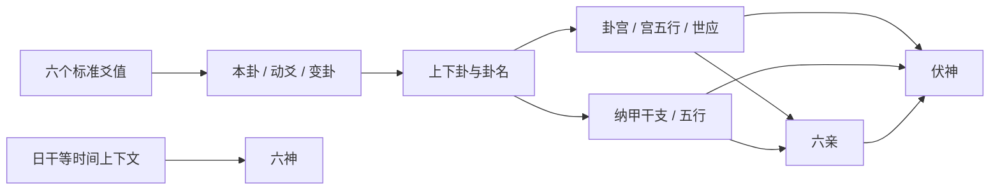

# SPEC-003 六爻基础卦面

> 状态：`Implemented Baseline / UI Review`  
> 版本：1.2  
> 最近更新：2026-08-07  
> 依赖：SPEC-001、SPEC-002、规则来源登记表

## 1. 目的

将标准化爻值和历法上下文计算为完整、稳定、可核对的六爻卦面，覆盖断卦所需的基础字段，并为高阶规则提供统一坐标。

## 2. 范围内

- 本卦、变卦、上下卦、卦名、卦宫、宫五行。
- 六条爻的阴阳、动静、纳甲干支、地支五行。
- 六亲、六神、世爻、应爻。
- 完整本伏：所属卦宫纯卦六条纳甲逐爻绑定本卦六个飞神位置。
- 排盘日期、农历、四柱或排盘所需干支上下文。
- 每项计算的规则编号、中间输入和结果说明。

当前生产合同为 schema v16。既有 `64 本卦 × 64 变卦` 结构矩阵继续覆盖产品卦面；私有参考合同对 64 个静态 plate 完整逐字段相等，并覆盖固定动爻的机械关系和扩展。变卦六亲始终以本卦宫五行为基准，但变卦卦宫、八宫序位和世应必须按变卦自身卦码独立计算。

## 3. 范围外

- 十二长生和神煞，由 SPEC-004 负责。
- 二十八宿，由 SPEC-008 负责。
- 解读、反馈和档案编辑，由 SPEC-005 负责。
- 吉凶判断、用神选择、自动断卦和 Agent。

## 4. 卦面信息层级

### A. 固定头部

占问、排盘时间、历法时间、起卦方式、规则版本。

### B. 卦象摘要

本卦、变卦、卦宫、宫五行、世应位置、动爻列表。

### C. 六爻主表

按上爻到初爻视觉排列，但每行保留稳定的内部序号 6 至 1。每行至少显示：六神、伏神、六亲、纳甲、五行、爻象、动静、世应，以及对应变爻信息。

### D. 规则与计算明细

按模块展开：卦象识别、纳甲、卦宫世应、六亲、六神、伏神。每步显示输入、采用表项/公式和结果。

## 5. 关键要求

- `FR-CHT-001` 同一标准输入和规则版本必须得到字节级语义一致的结构化结果。
- `FR-CHT-002` 地支字段必须只保存地支，天干、地支、五行不得黏连为不可解析文本。
- `FR-CHT-003` 本卦和变卦的每条爻具有稳定 ID，可供神煞、解读锚点和导出引用。
- `FR-CHT-004` 世应、伏神、六亲、六神均需保存“结果 + 规则 ID + 计算说明”。
- `FR-CHT-005` UI 排列方向和算法数组方向必须在契约中显式声明。
- `FR-CHT-006` 历法或规则资料缺失时，应返回明确的部分结果与诊断，不得猜测。
- `FR-CHT-007` 档案保存完整卦面快照和规则包版本。
- `FR-CHT-008` 本卦与变卦均保存所属卦宫和八宫卦序；卦序固定为本宫 1、初世 2、二世 3、三世 4、四世 5、五世 6、游魂 7、归魂 8，不得把世爻位置误作卦序。
- `FR-CHT-009` 天干和地支必须保持独立字段；UI 中天干按天干五行、地支按地支五行分别着色，不能把整组干支错用同一地支色。
- `FR-CHT-010` 动阳爻（9）显示 `Ｏ`，动阴爻（6）显示 `Χ`；符号只是动爻语义的文字补强，不取代原始 6/9 数值。
- `FR-CHT-011` 新排盘的六个本卦爻位都必须保存一条同位置伏神记录，来源固定为按 FR-CHT-013 生成的完整伏卦；不得只输出本卦缺失六亲对应的少数伏神。每条记录同时保存 `relation_missing_from_base`，用于区分该六亲是否在本卦明爻中缺失。
- `FR-CHT-012` 时间合同必须分别保存年、月、日、时四柱各自的旬空；基础卦面以“四柱一行、四旬空一行”的同列结构展示，不得只显示日柱旬空。六神与六亲在主表中必须使用完整名称。
- `FR-CHT-013` 伏卦内外卦分别判断：本卦对应经卦与宫卦相同则取宫卦错卦，不同则取宫卦；伏内卦和伏外卦合成完整伏卦。合同必须保存宫卦、错卦、内外比较结果、选择分支、伏卦码和伏卦名。
- `FR-CHT-014` 本卦、变卦与完整伏卦每爻必须保存纳音；规范用字与旧字形别名由统一词表管理。
- `FR-CHT-015` schema v14 同时保存产品完整伏卦和私有参考“缺失六亲伏神”，二者字段与用途独立，不得互相覆盖。
- `FR-CHT-016` `private_reference_contract` 必须保存源提交、profile、plate、机械关系和扩展版本；该合同是 C 级对照，不宣称传统权威。
- `FR-CHT-017` 有变卦时，变卦必须独立保存 `shi_position`、`ying_position`，并在对应两条 `changed.lines[].role` 标记“世”“应”；不得复制本卦角色或只在摘要中临时推算。
- `FR-CHT-018` 主表本卦、伏卦、变卦纳甲下方统一只显示“纳音·日柱十二长生·二十八宿”；不得重复显示单字五行，伏卦列不得再用“伏”字重复表达列身份。天干地支仍按五行着色。

## 6. 基础计算链

## 7. 验收重点

- 覆盖八纯卦、六合/六冲相关结构、无动爻、单动、多动、六爻皆动。
- 至少一组固定样例逐项核对卦宫、世应、纳甲、六亲、六神和伏神。
- 数据契约的 JSON schema、Python 类型、TypeScript 类型和 Dart model 含义一致。
- 计算明细可让熟悉规则的人从输入复算结论。

### 7.1 已就绪的上游输入合同

SPEC-002 已把排盘输出升级为 schema v2，并提供统一 `casting_record`：模式、模式版本、初爻到上爻的六值、逐爻原始输入、随机源和起卦计算轨迹。SPEC-003 必须消费该结构，不得从 Flutter 控件状态或 `raw_najia` 反推起卦过程。

历史 SQLite 记录可能仍为 schema v1；基础卦面升级不得静默改写旧 `chart_json`。新合同通过既有 `schema_version` 字段区分，无需为本次新增 JSON 字段修改数据库表。

### 7.2 本轮可执行规则包

当前实现固定 `liuyao.base.najia_2_0_1_compat.v1`，精确来源、查表和已知偏差见[基础卦面规则审计](../rules/base-chart-rule-audit.md)。它是 C 级来源支持的兼容基线，不替代未来 A/B 级传统主来源。

schema v3 必须新增并稳定以下结构：

- `rule_package`：规则包 ID、版本、状态、来源编号和上游精确版本。
- `time.pillars`：四柱分别保存干支、天干、地支；另存旬空地支数组和临时时间口径。
- `hexagram.line_order=bottom_to_top` 与 `display_order=top_to_bottom`。
- 本卦/变卦均保存 code、卦名、上下卦、卦宫、八宫卦序与各自世应；本卦另存动爻位置。
- 每爻保存稳定 ID、爻位、阴阳动静、六神、六亲、天干、地支、纳甲干支、五行和世应角色。
- 伏神保存稳定 ID、本宫纯卦来源、所伏飞神 ID、六亲、天干、地支和五行。
- 变卦六亲显式声明 `relative_basis=base_palace`。
- `calculation_trace` 至少覆盖起卦、卦象识别、上下卦、卦宫世应、纳甲、六亲、六神、伏神和变卦。

`raw_najia` 只允许用于诊断和回归，不得再作为 Flutter 展示、案例检索或后续十二长生/神煞的输入。

SPEC-004 后续将总排盘合同升级到 schema v4（十二长生）、v5（禄神）、v6（天乙）、v7（驿马）、v8（桃花/咸池）、v9（将星）及 v10（华盖）；这些版本只扩展顶层 `annotations` 与相应 trace，本 Spec 定义的 schema v3 基础卦面字段保持不变。

### 7.3 移动端首层字段

360dp 默认不横向滚动。摘要分别显示“本卦：卦名 / 卦宫·卦序”和“变卦：卦名 / 卦宫·卦序”。六爻主表按上爻到初爻排列，每爻同行对照：六神、伏神、本卦六亲纳甲、本卦爻象与 `Ｏ/Χ`、世应、变卦六亲纳甲、变卦爻象。完整公式与查表过程置于主表后的“计算明细”折叠区。

### 7.4 实现状态

schema v3 / engine `0.3.0+najia-2.0.1` 已实现：

- Python 自有规则模块负责纳甲、世应卦宫、六亲、六神、伏神、变卦和 trace；Najia 原始结构只作对照。
- 四柱、旬空和六神日干统一来自 cnlunar 适配层，并明确 `rule_status=provisional`。
- Python golden/invariant tests 覆盖 64 卦、固定多动含伏神、纯卦、日干六神和已知时间冲突边界。
- TypeScript 合同和 SQLite 快照 fixture 已升级；历史 schema v1/v2 不改写。
- Flutter 手动/自动结果共用完整卦面组件，在 360dp 测试中无水平溢出，计算明细可展开。

尚未把本 Spec 标为 `Implemented`，因为 Q-003 的最终时间边界与 Q-008 的 A/B 级传统主来源仍未关闭；已实现规则包和历史快照不受后续文档补齐影响。

schema v14 新增逐爻纳音和私有参考合同；schema v15 新增变卦自身世应与七项标注；schema v16 新增伏卦、变卦两层十二长生与京房逐爻宿。旧 schema v1–v15 均按原始快照读取，不补算。

## 8. 开放问题

- [Q-008](../project/open-questions.md)：当前已有可执行兼容包，传统最终权威表仍待补齐。
- [Q-009](../project/open-questions.md)：首个移动端切片已暂定字段密度，等待真机评审。
- [Q-010](../project/open-questions.md)：历史规则升级后的重算交互。

## 9. 变更记录

| 日期 | 版本 | 变更 | 证据 |
|---|---|---|---|
| 2026-08-07 | 1.2 | schema v16 统一三列副信息，去除重复五行/“伏”，补齐伏卦与变卦长生、星宿 | DEC-050、三层固定盘 golden |
| 2026-08-07 | 1.1 | schema v15 为变卦按自身卦码独立计算、保存并逐爻展示世应 | DEC-049、大畜三爻动之损 golden |
| 2026-08-07 | 1.0 | schema v14 加入逐爻纳音和私有参考合同；完整伏卦与缺失六亲伏神双轨保留 | DEC-048、64 卦完整 plate parity |
| 2026-08-05 | 0.8 | 纠正伏卦为内外卦分别比较宫卦的规则，新增结构化伏卦和可公开分享文档 | DEC-036、天雷无妄/山天大畜 golden、64 卦八宫表 |
| 2026-08-05 | 0.7 | 六亲六神改为完整名称；新增四柱逐柱旬空合同及卦面同级双行展示 | DEC-035、丙午/乙未/庚戌/丁亥 golden |
| 2026-08-05 | 0.6 | 伏神改为所属卦宫纯卦六爻全部逐位输出，保留缺失六亲标记；旧档案不补算 | DEC-034、64 卦本伏不变量测试 |
| 2026-08-05 | 0.5 | 本伏/本卦/变卦改为同行对照，增加 `Ｏ/Χ`、干支独立五行色，并纠正本变卦八宫卦序语义 | DEC-033、山天大畜→山泽损 golden |
| 2026-08-05 | 0.4 | 完成 schema v3、基础规则模块、64 卦测试、三端合同、移动端完整卦面和真实链路验证 | DEC-023、23 tests / 66 subtests |
| 2026-08-05 | 0.3 | 冻结 Najia 2.0.1 兼容规则包、schema v3 字段、时间单一来源、移动端首层密度和完整 trace 范围 | DEC-023、规则审计 |
| 2026-08-05 | 0.2 | 接受 schema v2 `casting_record` 作为唯一上游起卦输入，并明确 schema v1 历史快照不重写 | DEC-022 |
