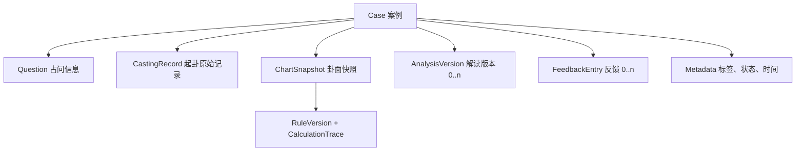

# SPEC-005 案例档案、解读与反馈

> 状态：`Implemented Baseline / UI Review`  
> 版本：0.6  
> 最近更新：2026-08-07  
> 依赖：SPEC-001 至 SPEC-004

## 1. 目的

把一次占问保存为可长期复盘的案例，同时严格区分原始起卦事实、计算结果、用户解读和事后反馈。

## 2. 范围内

- 新建、查看、编辑基础元数据、归档和恢复案例。
- 保存占问问题、分类/标签、起卦时间、创建与更新时间。
- 保存起卦原始记录、历法快照、卦面快照、规则版本和计算明细。
- 新增、编辑、查看解读版本。
- 新增、编辑、查看多条反馈记录。
- 档案列表、搜索、基础筛选和排序。
- 从案例进入导出。

### 2.1 当前已实现切片

- 手动、自动起卦完成后都会自动保存“当前已经生成并确认的完整 JSON 快照”，保存成功后直接进入独立卦面页；保存不会再次调用随机起卦。
- 设备端 schema v1 原子 JSON 容器保存占问、起卦时间/方式、本卦/变卦索引字段、完整 `ChartSnapshot`、创建和更新时间；无需网络与服务端数据库。
- 档案列表按最近更新倒序展示，并可搜索标题、占问、本卦、变卦、解读正文和反馈正文。
- 档案详情复用当前完整卦面组件，历史规则升级不会在打开旧档案时覆盖快照。
- schema v1/v2 历史快照通过只读兼容层展示已有字段；合同当时未保存的高阶字段明确提示“未记录”，不会用当前引擎补算。
- 解读使用不可变追加版本；写入时以 `expectedRevision` 做并发冲突保护。
- 反馈为可新增、可编辑的独立时间线，首轮状态为 `pending / matched / partial / not_matched`，可记录发生日期。
- 旧版直接以 case id 为根键的 JSON 可读取，并在下次写入迁移；未知版本和损坏 JSON 明确报错且不覆盖原文件。
- 数据文件固定写入系统分配的 App 私有 Documents 目录；退到后台、划掉任务和系统杀死进程不删除。只有卸载应用或用户在系统设置主动“清除应用数据”会删除。
- 启动时同时检查主文件与 `.tmp` 写入文件：选择更新时间较新且结构完整的一份；若主文件损坏而临时文件完整，则恢复临时文件并保留损坏副本。
- 档案页在 App 回到前台时自动重新读取，并明确展示“本机持久保存”，避免旧列表状态造成数据消失的误判。
- 档案页支持批量导出版本化迁移包；迁移包包含每一条完整卦面快照、全部不可变解读版本和全部反馈记录。
- 导入先做格式和数量预检，再展示新增、相同、冲突、解读和反馈数量。安全合并会跳过相同档案，并将同 ID 不同内容保存为“导入副本”；清空恢复必须二次确认。

### 2.2 当前未实现切片

- 标签、分类、元数据编辑、归档/恢复、软删除和附件。
- 账号同步、云备份和多端实时同步。

## 3. 范围外

- 自动生成解读或 Agent 对话。
- 社交分享、公开案例社区。
- 多人协同编辑、权限角色和云端同步；当前跨设备迁移只使用用户主动导出/导入的本地文件。
- 删除策略、设备备份的最终交互需单独做数据安全评审。

## 4. 数据分层

## 5. 关键要求

- `FR-CAS-001` 一个案例只能引用一次已确认的起卦记录；重新起卦应创建新案例或明确的新版本。
- `FR-CAS-002` 卦面按生成时快照保存，不依赖打开页面时重新计算。
- `FR-CAS-003` 解读采用追加版本，至少保存正文、创建时间、更新时间和版本号。
- `FR-CAS-004` 反馈是独立时间序列，可记录发生时间、正文、应验状态和可选附件占位。
- `FR-CAS-005` 编辑问题或备注不得修改原始起卦和卦面快照。
- `FR-CAS-006` 当前列表按最近更新排序；创建时间和占问时间筛选在后续切片实现。
- `FR-CAS-007` 当前搜索范围为标题、问题、本卦、变卦、解读和反馈；标签检索随标签功能后置。
- `FR-CAS-008` 涉及永久删除时必须二次确认；首版优先软删除或归档。
- `FR-CAS-009` 排盘与案例创建是一个用户提交流程；客户端不再提供可被忽略的“保存到档案”二次主操作。
- `FR-CAS-010` 案例创建成功返回的详情对象必须直接用于首次卦面渲染，避免为进入结果页又重新计算或再摇一次。
- `FR-CAS-011` 档案必须写入系统分配的 App 私有持久目录，不得使用系统临时目录、Widget 内存或进程缓存作为唯一数据源。
- `FR-CAS-012` 写入完成返回前必须 flush 并完成原子替换；异常中断后应从最新完整文件恢复，不得因存在损坏临时文件而清空主档案。
- `FR-CAS-013` App 从后台恢复时档案列表必须重新加载磁盘状态。
- `FR-CAS-014` 批量迁移不得丢弃旧解读版本、反馈、原始起卦、规则版本或计算明细。
- `FR-CAS-015` 导入必须在写入前完成版本、案例结构、声明数量和重复 ID 校验；失败时本机档案保持原样。
- `FR-CAS-016` 安全合并不得覆盖同 ID 的不同内容；清空恢复必须在预检后再次确认。

## 6. 档案详情结构

1. 占问摘要。
2. 时间与起卦方式。
3. 卦面快照。
4. 规则标注和计算明细。
5. 解读区：当前版本 + 历史版本。
6. 反馈时间线。
7. 导出与管理操作。

起卦后首次打开与从“档案”再次打开复用同一个详情页和同一份快照；首次打开只额外显示“已自动存入档案”的非阻塞状态。

## 7. 验收重点

- 保存后离线重开仍能查看完整案例。
- 编辑解读不会覆盖历史版本或反馈。
- 规则引擎升级后旧案例内容不变且可识别旧版本。
- 空解读、多个反馈、超长问题和无标签都能正常展示。

## 8. 开放问题

- [Q-014](../project/open-questions.md)：本地优先、账号同步与备份边界。
- [Q-015](../project/open-questions.md)：标签、分类和应验状态枚举。
- [Q-016](../project/open-questions.md)：解读是否支持 Markdown、富文本或纯文本。

## 9. 当前验收证据

- Flutter 档案测试覆盖自动保存、磁盘文件、进程重启恢复、旧版迁移、原子替换、较新临时文件恢复、损坏副本保护、解读 revision 冲突、反馈增改、批量迁移往返、合并冲突、替换恢复、UTF-8 和损坏包保护。
- Android `liuyao_api36` 真实验证：已有案例后执行 `am force-stop` 再冷启动，档案仍在；随后用 `adb install -r` 从 1.0.0 覆盖升级到 1.0.1，原案例仍在。
- 当前评审口径采用设备端版本化 JSON + 纯文本解读 + 四态反馈；未来若迁移 SQLite，必须保持相同 Case 合同并增加双向迁移测试。

## 10. 变更记录

| 日期 | 版本 | 变更 | 证据 |
|---|---|---|---|
| 2026-08-05 | 0.3 | 排盘与存档收敛为一次提交，保存成功后直接进入独立卦面页 | DEC-032、LG-20260805-04 |
| 2026-08-06 | 0.4 | 改为完全离线设备端原子 JSON，加入 v0 迁移、损坏保护和 revision 乐观锁 | DEC-038、DEC-040 |
| 2026-08-06 | 0.5 | 加固真实进程重启与中断恢复，前台自动刷新，并以 Android 强停/覆盖升级验证数据保留 | DEC-043 |
| 2026-08-07 | 0.6 | 增加完整批量迁移包、导入预检、安全合并与二次确认替换恢复；搜索覆盖解读和反馈 | DEC-047、迁移往返测试与 Android 实机流程 |
