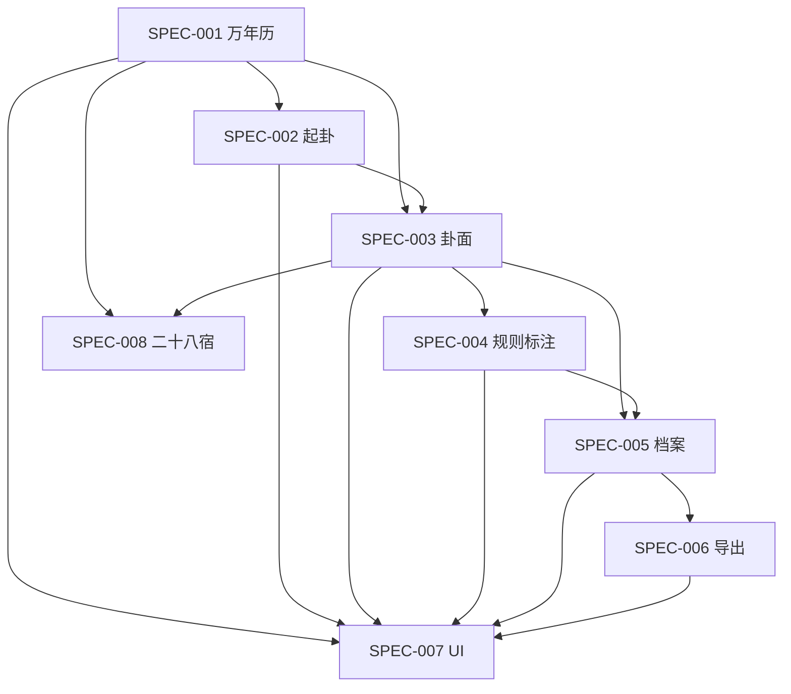

# Spec 范围与数据归属矩阵

> 状态：`Active`  
> 最近更新：2026-08-05

本表用于避免“同一个字段由多个模块重复计算或保存”。`Owner` 对该数据的定义和验收负责；其他模块只能引用。

| 能力/数据 | Owner | 输入来自 | 输出给 | 明确不负责 |
|---|---|---|---|---|
| 时间选择与历法上下文 | SPEC-001 | 用户时间、时区、可选地点 | SPEC-002/003/005 | 起卦、排盘判断 |
| 万年历值日二十八宿 | SPEC-001（展示）+ SPEC-008（规则） | 历法时间、待定规则 | 日详情、案例快照 | 六爻入卦落点 |
| 起卦原始过程 | SPEC-002 | 手动输入或随机过程 | SPEC-003/005 | 卦宫、六亲、神煞 |
| 本卦/变卦与基础卦面 | SPEC-003 | 标准爻值、历法上下文 | SPEC-004/005/006/007 | 神煞解释、用户解读 |
| 五行十二长生 | SPEC-004 | 爻五行/地支与已冻结基准 | SPEC-005/006/007 | 基础纳甲、吉凶结论 |
| 神煞命中与辅助结构 | SPEC-004 | 时间、卦、爻字段 | SPEC-005/006/007 | 自动断语 |
| 案例生命周期 | SPEC-005 | 001–004 的快照 + 用户文本 | SPEC-006/007 | 重新实现排盘算法 |
| 解读版本 | SPEC-005 | 用户编辑 | SPEC-006/007 | 事后事实反馈 |
| 反馈时间线 | SPEC-005 | 用户事后记录 | SPEC-006/007 | 修改历史卦面 |
| 导出文件 | SPEC-006 | 案例快照与用户选择 | 系统分享/文件 | 档案主数据编辑 |
| 导航、视觉与交互状态 | SPEC-007 | 各功能 Spec | Flutter 实现 | 定义术数规则 |
| 六爻二十八宿/五星入卦 | SPEC-008 | 用户资料、历法、卦面 | SPEC-005/006/007 | 值日宿日历算法（除非资料明确共用） |

## 关键边界

1. SPEC-001 输出时间事实，不计算六爻卦面。
2. SPEC-002 只负责“如何得到六个爻值”，不负责解释这些爻值。
3. SPEC-003 是基础卦面的唯一算法 Owner。
4. SPEC-004 只能在基础卦面上增加可关闭标注，不能改变本卦和变卦。
5. SPEC-005 保存快照，不在打开档案时悄悄调用最新规则覆盖旧结果。
6. SPEC-007 决定如何呈现，不在 Widget 内复制规则。
7. SPEC-008 已按用户确认规则输出逐爻配宿；万年历值日宿已作为独立 provider 字段实现，五星仍不得由任一结果推断。

## 依赖顺序

